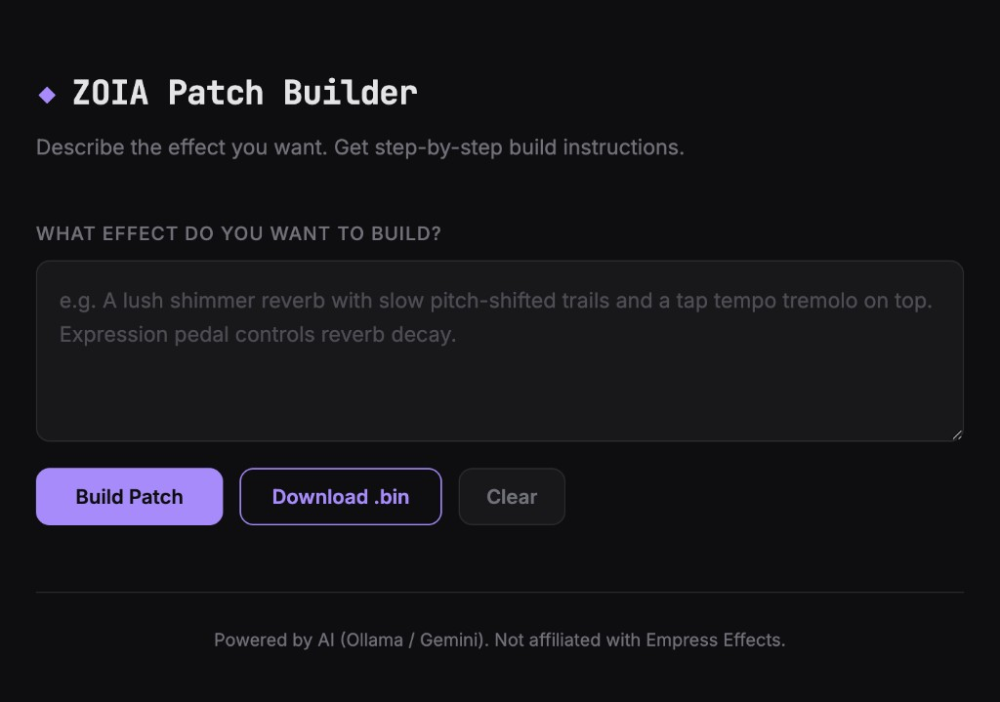

# ZOIA Patch Builder

Describe the guitar effect you want in plain language. Get step-by-step build instructions — or download a `.bin` file you can load directly onto the pedal.

Powered by AI (runs locally with Ollama, or via Google's Gemini API).



## Quick Start

You need **Python 3** installed. That's it.

### 1. Clone and set up

```bash
git clone https://github.com/boredomisacrime/zoia-builder.git
cd zoia-builder
bash setup.sh
```

The setup script creates a virtual environment and installs dependencies. If you don't have a local AI model, it will ask for a **Gemini API key** (free — get one at [aistudio.google.com/apikey](https://aistudio.google.com/apikey)).

### 2. Run

```bash
bash run.sh
```

### 3. Open

Go to **http://127.0.0.1:8080** in your browser.

Type something like:

> A lush shimmer reverb with slow pitch-shifted trails. Expression pedal controls decay. Tap tempo tremolo on top.

Hit **Build Patch** and wait for the instructions to stream in.

## Local Mode (Ollama)

If you want to run everything offline with no API key and no rate limits:

1. Install [Ollama](https://ollama.com/download)
2. Pull a model: `ollama pull gemma4:26b` (17 GB download)
3. Make sure Ollama is running (open the app)
4. `bash run.sh` — it auto-detects the local model

The app tries Ollama first. If it's not available, it falls back to Gemini.

## How It Works

The app sends your description to an AI model along with a detailed knowledge base covering every ZOIA module, its parameters, inputs/outputs, and conventions for building patches. The model returns structured instructions: signal flow, module placement on the grid, parameter values, connections, and stompswitch mappings.

## Not Affiliated

This is a personal project. Not affiliated with or endorsed by Empress Effects.
